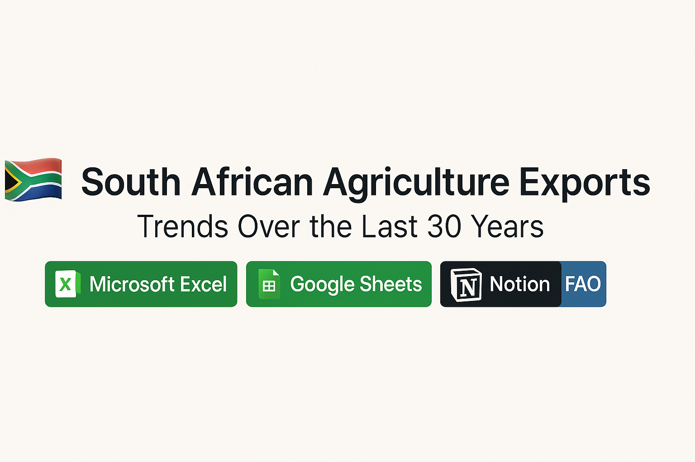

# 🇿🇦 **South African Agriculture Exports: Trends Over the Last 30 Years**  
📊 **Excel Dashboard Project**

---

  
  
  
  

---

## 📁 Project Overview  
This project presents an **interactive Excel dashboard** analysing South Africa's major **agricultural crop exports** over a 30-year period, based on data sourced from the **FAO Data Bank**.

🔗 **View the dashboard:** [📈 Excel Dashboard](https://docs.google.com/spreadsheets/d/1FV1zHqxTlm3BnQUNQkyAX_aRERsYlsC8k0fHtZdrfH0/edit?gid=1642849436#gid=1642849436)  
📝 **Read the full report:** [📄 Project Report](https://www.notion.so/Excel-Dashboard-19d56e4be2ae80f18498efa0d42e57b4?pvs=4)

---

## 🔧 Process & Tools Used  
The data preparation and analysis were carried out in **Microsoft Excel**, with the following steps:

- 🧹 **Data Cleaning** using functions such as `TRIM`, `TEXT`, `IF`, and `AND`
- 📊 **Pivot Tables** for:
  - Export volumes per crop  
  - Export value (ZAR) per crop  
  - Export trends over time  

---

## 🎯 Outcomes & Use Cases  
This dashboard offers valuable insights for:

- 🌱 **Farmers** – to guide decisions on what crops to cultivate based on export demand  
- 🏭 **Agri-business stakeholders** – for economic and trade planning  
- 📈 Understanding long-term export trends by crop and value  

---

## ✨ Highlights  
- 30 years of historical export data  
- Visual trends and comparisons  
- Clean, user-friendly dashboard design  
- Practical for **decision-making** in the agriculture value chain  

---

### 👩‍💻 Created by: **Lucille Jordaan** | 2025

---

